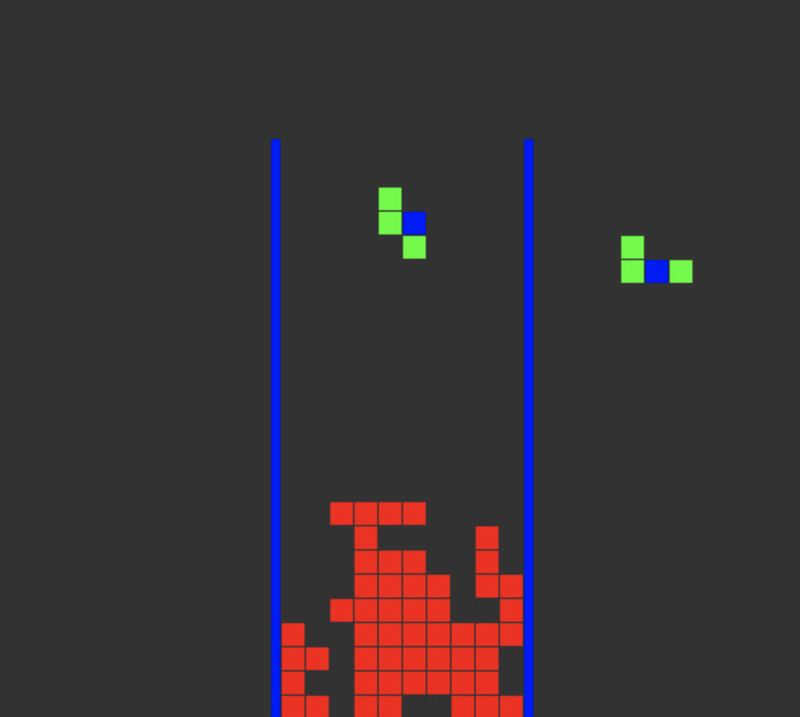
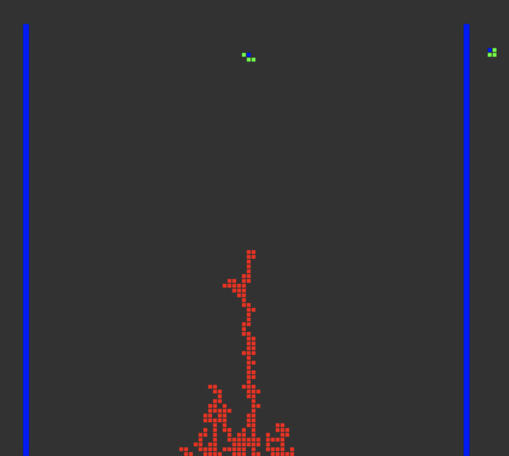

# Tetris

<table border="none">
 <tr>
    <td width="200px"> </td>
    <td width="auto">A very simple tetris game built with SDL library. As the usual tetris game, 5 different types of pieces exists and the aim of the game is avoid making the board full of pieces. When the bottom row is filled, then it is deleted starting from bottom to up and deletes consecutive full rows.
    Also, you can see the next piece on the right of the screen</td>
 </tr>
</table>

## Dependencies

    - SDL
    - SDL_gfx

## Install

    - brew install sdl
    - brew install sdl_gfx

## Compile

    - make

## Gameplay

<kbd>Z</kbd> Rotate piece

<kbd>X</kbd> Drop piece

<kbd>Left</kbd> Move piece to left

<kbd>Right</kbd> Move piece to right

<kbd>Down</kbd> Move piece to down

<kbd>Esc</kbd> Quit game

## Bonus

<table border="none">
 <tr>
    <td width="300px"> </td>
    <td width="auto">You can change the macros defined in the <code>board.h</code> and resize the game.</td>
 </tr>
</table>